#  Kubernetes + Helm + Redis + Jenkins DEPLOYMENT

## 1. Project Overview

This project deploys a PHP Todo application on a Kubernetes cluster using Helm.

The project extends the previous Docker/Kubernetes application by adding:

* Redis caching
* Helm package management
* Kubernetes Secrets
* MySQL StatefulSet
* Persistent Volume
* Kubernetes ConfigMap for database initialization
* Application health probes
* Multiple PHP application replicas

### Architecture

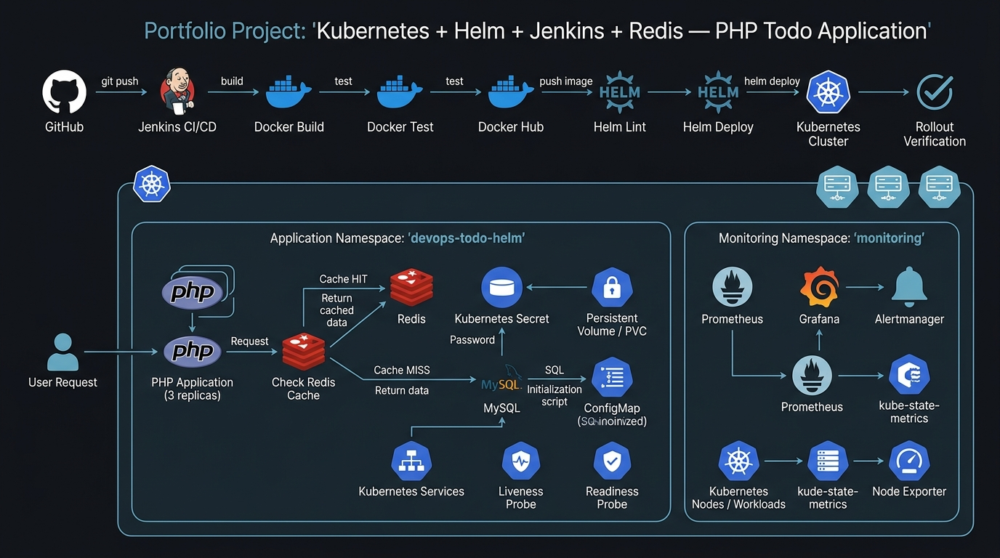
---

# 2. Add Redis Caching to the PHP Application

Before creating the Kubernetes infrastructure, the PHP application was modified to use Redis.

The purpose of Redis is to avoid querying MySQL every time the Todo list is requested.

Instead, the application follows this flow:

```text
User requests Todo list
        │
        ▼
   Check Redis
        │
   ┌────┴────┐
   │         │
 Cache HIT  Cache MISS
   │         │
   ▼         ▼
Return     Query MySQL
cached       │
data         ▼
           Store data
           in Redis
              │
              ▼
          Return data
```

This reduces unnecessary database queries and demonstrates a common caching pattern.

## 2.1 Install the PHP Redis Extension

The Docker image was modified to install the Redis PHP extension.

### Dockerfile

```dockerfile
FROM php:8.2-apache

RUN docker-php-ext-install mysqli pdo pdo_mysql

RUN pecl install redis \
    && docker-php-ext-enable redis

COPY ./Apps /var/www/html

EXPOSE 80
```

The important part is:

```dockerfile
RUN pecl install redis \
    && docker-php-ext-enable redis
```

This allows PHP to communicate with the Redis server.

---

# 3. Create the Redis Connection

A separate PHP file was created:

```text
Apps/
└── redis.php
```

### redis.php

```php
<?php

$redis = new Redis();

$redisHost = getenv('REDIS_HOST') ?: 'redis';
$redisPort = getenv('REDIS_PORT') ?: 6379;

$redis->connect($redisHost, $redisPort);
```

The application does not use `localhost` for Redis.

Instead, it uses:

```text
redis
```

because `redis` will become the Kubernetes Service name.

Kubernetes provides internal DNS, allowing the PHP containers to reach:

```text
redis:6379
```

---

# 4. Check Redis Before Querying MySQL

The Todo application was modified so that the application checks Redis before querying MySQL.

For example, the application can use a cache key:

```php
$cacheKey = 'tasks';
```

Then check Redis:

```php
$cachedTasks = $redis->get($cacheKey);
```

If Redis already contains the data:

```php
if ($cachedTasks !== false) {

    $tasks = json_decode($cachedTasks, true);

} else {

    // Query MySQL

}
```

When the data is not in Redis, the application queries MySQL and then stores the result in Redis.

Example:

```php
$result = $conn->query("SELECT * FROM tasks ORDER BY id DESC");

$tasks = [];

while ($row = $result->fetch_assoc()) {
    $tasks[] = $row;
}

$redis->setex(
    $cacheKey,
    60,
    json_encode($tasks)
);
```

The cache expiration was set to:

```text
60 seconds
```

Therefore, cached Todo data automatically expires after 60 seconds.

---

# 5. Invalidate Redis Cache After Changes

Caching introduces an important problem.

If a user adds, edits or deletes a Todo item, Redis could still contain old data.

Therefore, the cache must be deleted whenever the database is modified.

For example:

```php
$redis->del('tasks');
```

This was added to operations such as:

* Add Todo
* Edit Todo
* Delete Todo

The resulting behavior is:

```text
ADD / EDIT / DELETE
       │
       ▼
   MySQL update
       │
       ▼
 Redis cache deleted
       │
       ▼
Next GET request
       │
       ▼
Query MySQL
       │
       ▼
Store fresh data in Redis
```

---

# 6. Clone the Project

The project repository is:

```text
https://github.com/Tamiru-Assefa/devops-php-todo-helm-redis
```

Clone it on the Kubernetes master/control-plane environment:

```bash
git clone https://github.com/Tamiru-Assefa/devops-php-todo-helm-redis.git
```

Enter the project:

```bash
cd devops-php-todo-helm-redis
```

Check the files:

```bash
ls
```

The main structure is:

```text
devops-php-todo-helm-redis/
│
├── Apps/
├── Jenkins/
├── helm-chart/
├── Dockerfile
└── Jenkinsfile
```

---

# 7. Build the Docker Image

Build the application image:

```bash
docker build -t ybtamiru/devops-php-todo-helm:1.0 .
```

Check that the image exists:

```bash
docker images
```

The image contains:

* Apache
* PHP 8.2
* mysqli
* PDO
* PDO MySQL
* PHP Redis extension
* Todo application

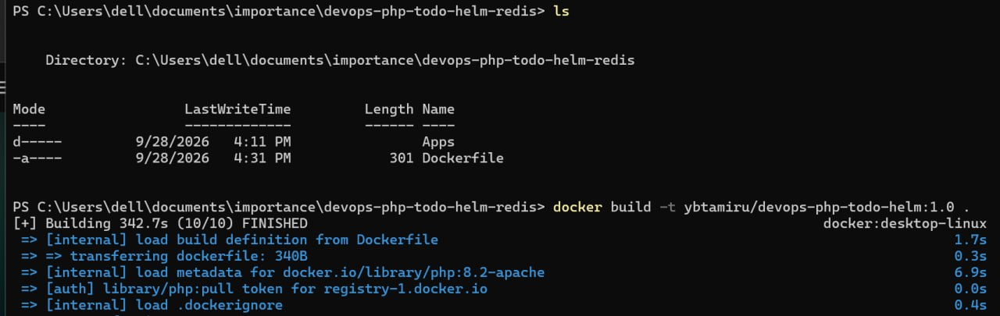

---

# 8. Check the Kubernetes Cluster

Before deploying anything, check the Kubernetes context:


Check the nodes:

```bash
kubectl get nodes
```

The cluster contains three nodes:

All nodes should show:

```text
Ready
```

---

# 9. Check Existing Namespaces

List namespaces:

```bash
kubectl get namespaces
```

The application will be deployed into its own namespace.

---

# 10. Create a New Namespace

Create the namespace:

```bash
kubectl create namespace devops-todo-helm
```

Verify:

```bash
kubectl get namespaces
```

The new namespace should appear:

```text
devops-todo-helm
```

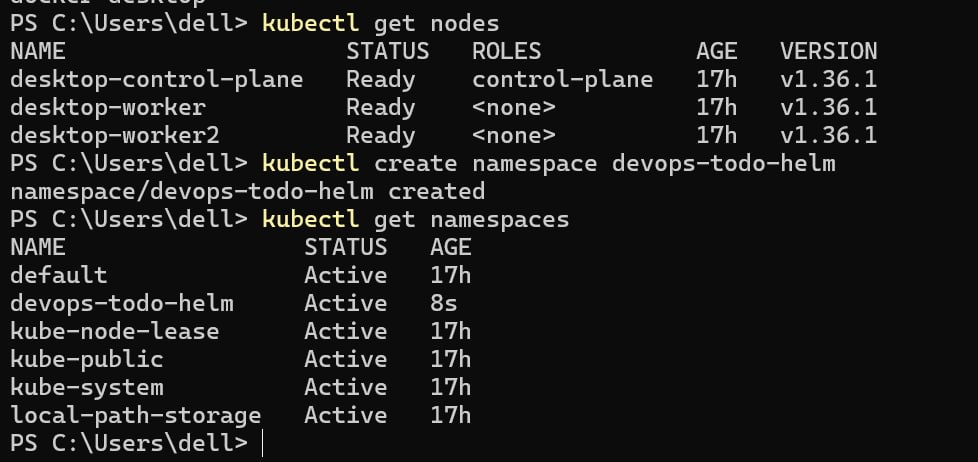

Using a dedicated namespace keeps the application resources separated from other Kubernetes resources.

---

# 11. Install Helm

Check whether Helm is installed:

```bash
helm version
```

If Helm is not installed, install it according to the operating system being used.
E.g Windows
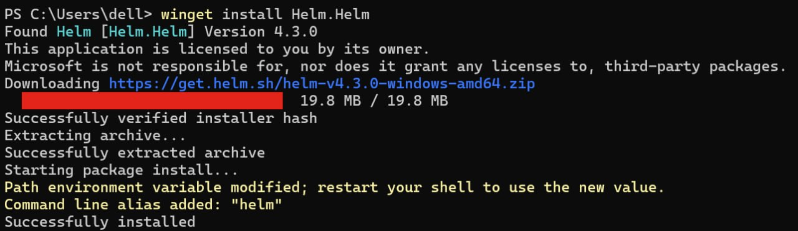

After installation:

```bash
helm version
```

Helm is used to package and deploy the Kubernetes application instead of manually applying every YAML file.

---

# 12. Create the Helm Chart

From the project root:

```bash
helm create helm-chart
```

This creates the basic Helm chart structure.

The chart is then customized for the Todo application.

Final structure:

```text
helm-chart/
│
├── Chart.yaml
├── values.yaml
├── files/
│   └── taskdb.sql
│
└── templates/
    ├── app-deployment.yaml
    ├── app-service.yaml
    ├── mysql-secret.yaml
    ├── mysql-init-configmap.yaml
    ├── mysql-statefulset.yaml
    ├── mysql-service.yaml
    └── redis.yaml
```
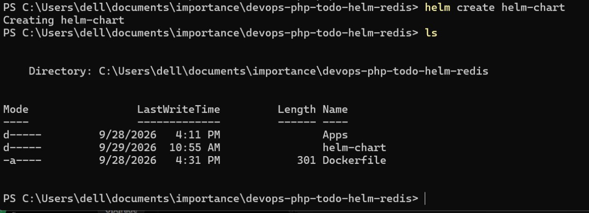
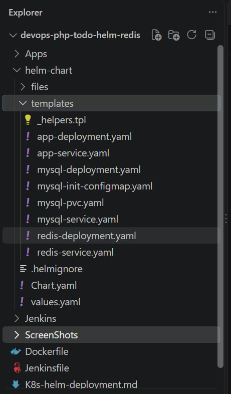

---

# 13. Configure Chart.yaml

Open:

```text
helm-chart/Chart.yaml
```

Use:

```yaml
apiVersion: v2
name: devops-php-todo
description: A Helm chart for the PHP Todo application
type: application
version: 0.1.0
appVersion: "1.0"
```

### Explanation

```yaml
apiVersion: v2
```

Defines the Helm chart API version.

```yaml
name: devops-php-todo
```

Defines the chart name.

```yaml
type: application
```

Specifies that this is an application chart.

```yaml
version: 0.1.0
```

Defines the Helm chart version.

```yaml
appVersion: "1.0"
```

Defines the application version.

---

# 14. Configure values.yaml

The main configurable values are placed in:

```text
helm-chart/values.yaml
```

Use:

```yaml
replicaCount: 3

image:
  repository: ybtamiru/devops-php-todo-helm
  tag: "1.0"
  pullPolicy: Always

service:
  type: NodePort
  port: 80
  nodePort: 30081

mysql:
  image: mysql:8.4
  database: taskdb
  user: todo_user

redis:
  image: redis:7
  port: 6379
```

This allows the deployment configuration to be changed without modifying the Kubernetes templates.

For example:

```yaml
replicaCount: 3
```

means Kubernetes should run three PHP application replicas.

The application image is:

```yaml
image:
  repository: ybtamiru/devops-php-todo-helm
```

Redis uses:

```yaml
redis:
  image: redis:7
  port: 6379
```

---

# 15. Create the MySQL Secret

Database passwords should not be stored directly inside `values.yaml`.

Create a Kubernetes Secret:

```bash
kubectl create secret generic todo-mysql-secret \
  --from-literal=MYSQL_ROOT_PASSWORD=<ROOT_PASSWORD> \
  --from-literal=MYSQL_PASSWORD=<MYSQL_PASSWORD> \
  -n devops-todo-helm
```

Verify the Secret:

```bash
kubectl get secrets -n devops-todo-helm
```
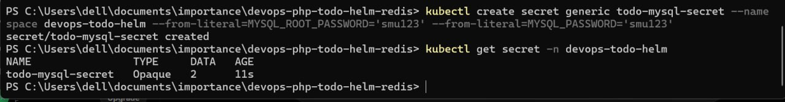


The actual password should never be committed to Git.

---

# 16. Create the Application Deployment

Create:

```text
helm-chart/templates/app-deployment.yaml
```

The Deployment is responsible for running the PHP application replicas.

Important configuration:

```yaml
apiVersion: apps/v1
kind: Deployment
metadata:
  name: {{ include "devops-php-todo.fullname" . }}
spec:
  replicas: {{ .Values.replicaCount }}

  selector:
    matchLabels:
      app: {{ include "devops-php-todo.fullname" . }}

  template:
    metadata:
      labels:
        app: {{ include "devops-php-todo.fullname" . }}

    spec:
      containers:
        - name: php-todo
          image: "{{ .Values.image.repository }}:{{ .Values.image.tag }}"
          imagePullPolicy: {{ .Values.image.pullPolicy }}

          ports:
            - containerPort: 80

          env:
            - name: DB_HOST
              value: mysql

            - name: MYSQL_DATABASE
              value: {{ .Values.mysql.database | quote }}

            - name: MYSQL_USER
              value: {{ .Values.mysql.user | quote }}

            - name: MYSQL_PASSWORD
              valueFrom:
                secretKeyRef:
                  name: todo-mysql-secret
                  key: MYSQL_PASSWORD

            - name: REDIS_HOST
              value: redis

            - name: REDIS_PORT
              value: {{ .Values.redis.port | quote }}

          readinessProbe:
            httpGet:
              path: /
              port: 80
            initialDelaySeconds: 10
            periodSeconds: 10

          livenessProbe:
            httpGet:
              path: /
              port: 80
            initialDelaySeconds: 30
            periodSeconds: 20
```

The important environment variables are:

```text
DB_HOST=mysql
REDIS_HOST=redis
REDIS_PORT=6379
```

Kubernetes Services provide these internal DNS names.

---

# 17. Create the Helm Files Directory

Create:

```text
helm-chart/files/
```

PowerShell:

```powershell
mkdir .\helm-chart\files
```

Linux:

```bash
mkdir -p helm-chart/files
```

This directory will contain the SQL initialization file.

---

# 18. Create the MySQL Initialization SQL

Create:

```text
helm-chart/files/taskdb.sql
```

The SQL file creates the Todo database structure.

Example:

```sql
CREATE DATABASE IF NOT EXISTS taskdb;

USE taskdb;

CREATE TABLE IF NOT EXISTS tasks (
    id INT AUTO_INCREMENT PRIMARY KEY,
    title VARCHAR(255) NOT NULL,
    completed BOOLEAN DEFAULT FALSE,
    created_at TIMESTAMP DEFAULT CURRENT_TIMESTAMP
);
```

The SQL file will later be loaded into Kubernetes using a ConfigMap.

---

# 19. Create mysql-init-configmap.yaml

Create:

```text
helm-chart/templates/mysql-init-configmap.yaml
```

The ConfigMap loads the SQL file from the Helm chart:

```yaml
apiVersion: v1
kind: ConfigMap
metadata:
  name: mysql-init
data:
  taskdb.sql: |
{{ .Files.Get "files/taskdb.sql" | indent 4 }}
```

The important Helm function is:

```text
.Files.Get
```

It reads the SQL file from:

```text
helm-chart/files/taskdb.sql
```

and places it into the ConfigMap.

---

# 20. Create the MySQL StatefulSet

MySQL uses a StatefulSet because the database needs stable storage and identity.

Create:

```text
helm-chart/templates/mysql-statefulset.yaml
```

The StatefulSet uses:

```yaml
apiVersion: apps/v1
kind: StatefulSet
```

and connects the MySQL container to:

* Kubernetes Secret
* ConfigMap
* Persistent Volume

The MySQL password is loaded from the Secret rather than hard-coded into the deployment.

The SQL initialization file is mounted into:

```text
/docker-entrypoint-initdb.d/
```

MySQL automatically processes initialization SQL files placed in this directory when initializing a new database volume.

---

# 21. Create the MySQL Service

The application needs a stable DNS name to reach MySQL.

Create a Kubernetes Service named:

```text
mysql
```

The PHP application therefore connects using:

```text
mysql:3306
```

instead of an IP address.

This is important because Pod IP addresses can change.

The Service provides a stable internal endpoint.

---

# 22. Create Redis Deployment

Create:

```text
helm-chart/templates/redis.yaml
```

Redis is deployed separately from the PHP application.

Basic configuration:

```yaml
apiVersion: apps/v1
kind: Deployment
metadata:
  name: redis
spec:
  replicas: 1

  selector:
    matchLabels:
      app: redis

  template:
    metadata:
      labels:
        app: redis

    spec:
      containers:
        - name: redis
          image: {{ .Values.redis.image }}
          ports:
            - containerPort: 6379

          args:
            - "--appendonly"
            - "yes"

          livenessProbe:
            tcpSocket:
              port: 6379
            initialDelaySeconds: 10
            periodSeconds: 10

          readinessProbe:
            tcpSocket:
              port: 6379
            initialDelaySeconds: 5
            periodSeconds: 5
```

Redis listens on:

```text
6379
```

---

# 23. Create the Redis Service

The Redis Service is named:

```text
redis
```

Therefore the PHP application can connect to:

```text
redis:6379
```

The application does not need to know the Redis Pod IP address.

Kubernetes DNS resolves:

```text
redis
```

to the Redis Service.

---

# 24. Lint the Helm Chart

Before installing the application, validate the Helm chart.

Run:

```bash
helm lint ./helm-chart
```
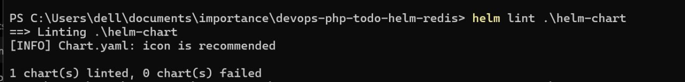

This verifies that the Helm chart is syntactically valid and helps detect configuration/template problems before deployment.

---

# 25. Install the Helm Release

Install the application:

```bash
helm install devops-todo ./helm-chart \
  --namespace devops-todo-helm
```

If using PowerShell:

```powershell
helm install devops-todo .\helm-chart `
  --namespace devops-todo-helm
```

The release name is:

```text
devops-todo
```

The chart is installed into:

```text
devops-todo-helm
```
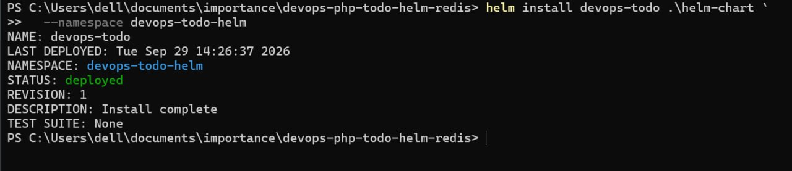

---

# 26. Check the Helm Release

Run:

```bash
helm list -n devops-todo-helm
```

Expected:

```text
devops-todo
```

---

# 27. Check the Pods

Run:

```bash
kubectl get pods -n devops-todo-helm
```

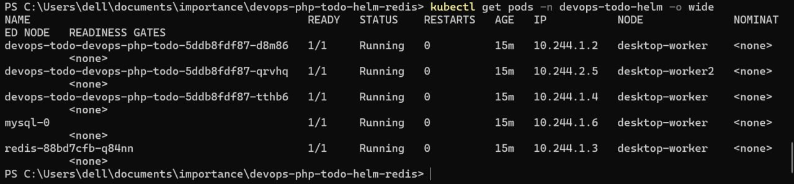
---

# 28. Check the Services

Run:

```bash
kubectl get services -n devops-todo-helm
```

The important Services are:

```text
devops-todo-devops-php-todo
mysql
redis
```

The PHP application is exposed through the configured NodePort.

MySQL and Redis remain internal Kubernetes Services.

---

# 29. Check MySQL

First find the MySQL Pod:

```bash
kubectl get pods -n devops-todo-helm
```

The StatefulSet creates:

```text
mysql-0
```

Execute a shell inside the MySQL container:

```bash
kubectl exec -it mysql-0 -n devops-todo-helm -- bash
```

Connect to MySQL:

```bash
mysql -u root -p
```

Enter the MySQL root password from the Kubernetes Secret.

---

# 30. Verify the Database

Inside MySQL:

```sql
SHOW DATABASES;
```

The database should include:

```text
taskdb
```

Select it:

```sql
USE taskdb;
```

Check the tables:

```sql
SHOW TABLES;
```

The Todo table should appear:

```text
tasks
```
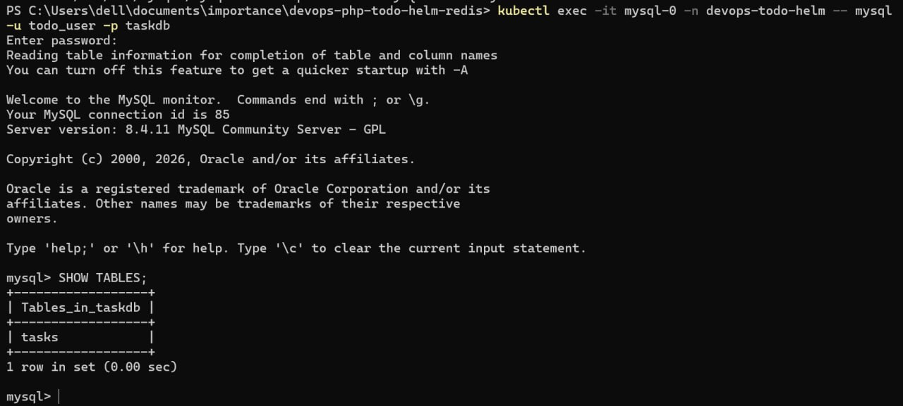

This confirms that:

1. MySQL is running.
2. The Persistent Volume is mounted.
3. The initialization ConfigMap worked.
4. `taskdb.sql` was processed.
5. The `taskdb` database exists.
6. The `tasks` table exists.

Exit MySQL:

```sql
exit
```

Then exit the container:

```bash
exit
```

---

# 31. Verify Redis

Check the Redis Pod:

```bash
kubectl get pods -n devops-todo-helm
```

Then execute Redis CLI inside the Redis container:

```bash
kubectl exec -it deploy/redis -n devops-todo-helm -- redis-cli
```

Test Redis:

```text
PING
```

Expected:

```text
PONG
```

Exit:

```text
exit
```

---

# 32. Verify the PHP Application

The application can be tested through port forwarding if NodePort access is unavailable in the local Docker Desktop Kubernetes environment.

Run:

```bash
kubectl port-forward svc/devops-todo-devops-php-todo \
  -n devops-todo-helm 8080:80
```

Then open:

```text
http://localhost:8080
```

The PHP Todo application should load.

At this point the basic Project 4 application infrastructure is working:

```text
PHP
 │
 ├── Redis
 │
 └── MySQL
       │
       └── Persistent Storage
```

The application is packaged with Helm and deployed into its own Kubernetes namespace.


---

# 33. Create the Jenkins Docker Image

The next step is to automate the Docker build and Kubernetes deployment using Jenkins.

A custom Jenkins image is used because Jenkins needs the following tools:

* Docker CLI
* kubectl
* Helm

Create:

```text
Jenkins/
└── Dockerfile
```

The Dockerfile:

```dockerfile
FROM jenkins/jenkins:lts-jdk21

USER root

RUN apt-get update && \
    apt-get install -y docker.io curl && \
    rm -rf /var/lib/apt/lists/*

# Install kubectl
RUN curl -LO "https://dl.k8s.io/release/$(curl -L -s https://dl.k8s.io/release/stable.txt)/bin/linux/amd64/kubectl" && \
    install -o root -g root -m 0755 kubectl /usr/local/bin/kubectl && \
    rm kubectl

# Install Helm
RUN curl https://raw.githubusercontent.com/helm/helm/main/scripts/get-helm-3 | bash

USER jenkins
```

Build the Jenkins image:

```powershell
docker build -t devops-jenkins-helm:1.0 .\Jenkins
```

Check the image:

```powershell
docker images
```
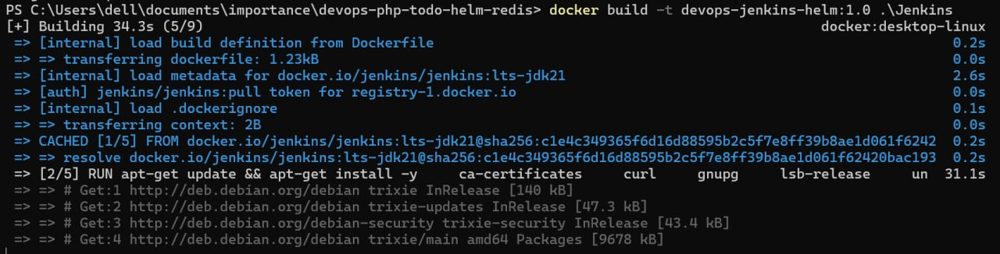
---

# 34. Run Jenkins

Jenkins needs access to the Docker daemon.

Run:

```powershell
docker run -d `
  --name jenkins `
  --restart unless-stopped `
  --group-add 0 `
  -p 8081:8080 `
  -p 50000:50000 `
  -v jenkins_home:/var/jenkins_home `
  -v /var/run/docker.sock:/var/run/docker.sock `
  -v "${PWD}\Jenkins\kubeconfig:/var/jenkins_home/.kube/config" `
  devops-jenkins-helm:1.0
```

The Jenkins web interface is available at:

```text
http://localhost:8081
```

---

# 35. Configure Jenkins Docker Access

The Docker socket is mounted into Jenkins:

```text
/var/run/docker.sock
```

This allows Jenkins to execute commands such as:

```bash
docker build
docker run
docker push
```

The `--group-add 0` option allows the Jenkins container to access the Docker socket.

Verify Docker from inside Jenkins:

```bash
docker version
```

---

# 36. Configure Kubernetes Access for Jenkins

Jenkins also needs access to the Kubernetes cluster.

The Kubernetes configuration is stored locally in:

```text
Jenkins/kubeconfig
```

The kubeconfig is mounted into Jenkins:

```text
/var/jenkins_home/.kube/config
```

Because Jenkins runs inside a container, the Kubernetes API cannot use:

```text
127.0.0.1
```

for the host machine.

Therefore the Kubernetes API address is changed to:

```text
host.docker.internal
```

The kubeconfig should **not** be committed to Git.

Add it to:

```text
.gitignore
```

For example:

```text
Jenkins/kubeconfig
```

---

# 37. Verify Kubernetes Access from Jenkins

Enter the Jenkins container:

```powershell
docker exec -it jenkins bash
```

Then:

```bash
kubectl get nodes
```

The three Kubernetes nodes should be visible:

```text
desktop-control-plane
desktop-worker
desktop-worker2
```

All should show:

```text
Ready
```

Exit Jenkins:

```bash
exit
```

---

# 38. Configure Docker Hub Credentials

Jenkins needs credentials to push Docker images.

In Jenkins:

```text
Manage Jenkins
        ↓
Credentials
        ↓
Global credentials
        ↓
Add Credentials
```

Select:

```text
Kind: Username with password
```

Use:

```text
Username: ybtamiru
Password: Docker Hub Access Token
ID: dockerhub-credentials
```

The important part is the credential ID:

```text
dockerhub-credentials
```

This ID is used by the Jenkinsfile.

---

# 39. Create the Jenkins Pipeline

The Jenkins pipeline automates:

```text
Checkout
   ↓
Docker Build
   ↓
Docker Test
   ↓
Docker Push
   ↓
Helm Lint
   ↓
Helm Deploy
   ↓
Kubernetes Verification
```

The Jenkinsfile:

```groovy
pipeline {
    agent any

    environment {
        IMAGE_NAME = 'ybtamiru/devops-php-todo-helm'
        IMAGE_TAG  = "${BUILD_NUMBER}"
        NAMESPACE  = 'devops-todo-helm'
        RELEASE    = 'devops-todo'
    }

    stages {

        stage('Checkout') {
            steps {
                checkout scm
            }
        }

        stage('Build Docker Image') {
            steps {
                sh '''
                    docker build \
                      -t ${IMAGE_NAME}:${IMAGE_TAG} \
                      .
                '''
            }
        }

        stage('Test Docker Image') {
            steps {
                sh '''
                    docker run --rm \
                      ${IMAGE_NAME}:${IMAGE_TAG} \
                      php -m | grep -E "mysqli|redis"
                '''
            }
        }

        stage('Push Docker Image') {
            steps {
                withCredentials([
                    usernamePassword(
                        credentialsId: 'dockerhub-credentials',
                        usernameVariable: 'DOCKER_USERNAME',
                        passwordVariable: 'DOCKER_PASSWORD'
                    )
                ]) {
                    sh '''
                        echo "$DOCKER_PASSWORD" | docker login \
                          -u "$DOCKER_USERNAME" \
                          --password-stdin

                        docker push ${IMAGE_NAME}:${IMAGE_TAG}

                        docker logout
                    '''
                }
            }
        }

        stage('Helm Lint') {
            steps {
                sh '''
                    helm lint ./helm-chart
                '''
            }
        }

        stage('Helm Deploy') {
            steps {
                sh '''
                    helm upgrade --install ${RELEASE} ./helm-chart \
                      --namespace ${NAMESPACE} \
                      --set image.repository=${IMAGE_NAME} \
                      --set image.tag=${IMAGE_TAG}
                '''
            }
        }

        stage('Verify Deployment') {
            steps {
                sh '''
                    kubectl rollout status \
                      deployment/devops-todo-devops-php-todo \
                      -n ${NAMESPACE} \
                      --timeout=180s

                    kubectl get pods -n ${NAMESPACE}
                '''
            }
        }
    }
}
```

---

# 40. Why BUILD_NUMBER Is Used

The Docker image tag is generated automatically:

```groovy
IMAGE_TAG = "${BUILD_NUMBER}"
```

For example:

```text
Jenkins Build #1
        ↓
:1

Jenkins Build #2
        ↓
:2

Jenkins Build #3
        ↓
:3
```

This prevents every deployment from using the same Docker tag.

It also makes it possible to identify which Jenkins build produced a specific application image.

---

# 41. Create the Jenkins Pipeline Job

In Jenkins:

```text
New Item
```

Choose:

```text
Pipeline
```

Configure the project to use the repository:

```text
https://github.com/Tamiru-Assefa/devops-php-todo-helm-redis.git
```

Use the repository's:

```text
Jenkinsfile
```

Then save the job.
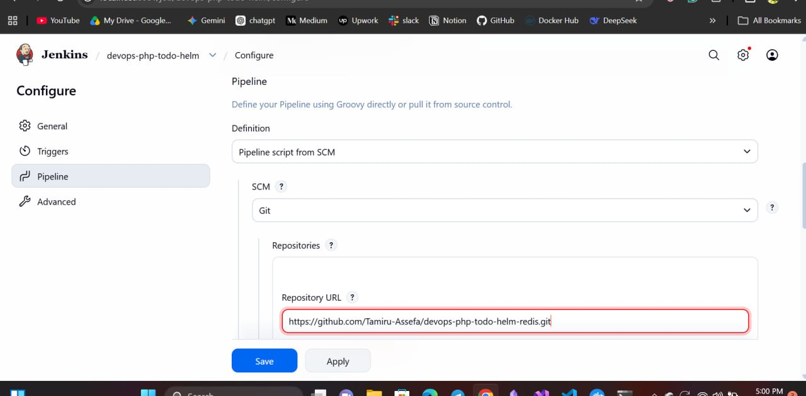

---

# 42. Run the Jenkins Pipeline

Click:

```text
Build Now
```

The pipeline should execute:

```text
Checkout
   ✓
Build Docker Image
   ✓
Test Docker Image
   ✓
Push Docker Image
   ✓
Helm Lint
   ✓
Helm Deploy
   ✓
Verify Deployment
   ✓
```

A successful build confirms that Jenkins can communicate with:

* Git
* Docker
* Docker Hub
* Helm
* Kubernetes

---

# 43. Verify the Docker Image

After Jenkins finishes, check Docker Hub.

The repository is:

```text
ybtamiru/devops-php-todo-helm
```

Images are tagged according to the Jenkins build number.

For example:

```text
ybtamiru/devops-php-todo-helm:3
```

This image was built and pushed automatically by Jenkins.

---

# 44. Verify the Helm Deployment

Check the Helm release:

```bash
helm list -n devops-todo-helm
```

Expected release:

```text
devops-todo
```

Check the release status:

```bash
helm status devops-todo -n devops-todo-helm
```

The release should show:

```text
STATUS: deployed
```
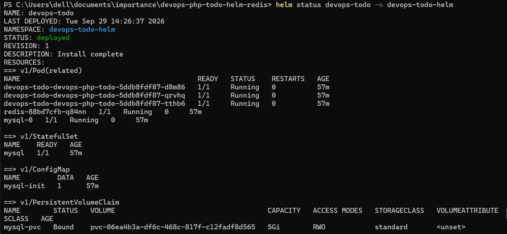
---

# 45. Verify the Kubernetes Deployment

Run:

```bash
kubectl get deployments -n devops-todo-helm
```

The PHP deployment should show three replicas:

```text
READY
3/3
```

Check:

```bash
kubectl get pods -n devops-todo-helm
```

Expected:

```text
PHP Pod       Running
PHP Pod       Running
PHP Pod       Running
Redis Pod     Running
MySQL Pod     Running
```

---

# 46. Verify Application Health Probes

The PHP application uses two Kubernetes probes.

### Readiness Probe

```yaml
readinessProbe:
  httpGet:
    path: /
    port: 80
```

The readiness probe determines whether a Pod is ready to receive traffic.

### Liveness Probe

```yaml
livenessProbe:
  httpGet:
    path: /
    port: 80
```

The liveness probe determines whether the application is still functioning.

If a container becomes unhealthy, Kubernetes can restart it.

This is an important production-oriented Kubernetes feature.

---

# 47. Verify Redis Caching

The Redis Pod can be checked:

```bash
kubectl get pods -n devops-todo-helm
```

Connect to Redis:

```bash
kubectl exec -it deploy/redis \
  -n devops-todo-helm -- redis-cli
```

Check:

```text
PING
```

Expected:

```text
PONG
```

The application then uses Redis for the Todo cache.

The flow is:

```text
HTTP Request
     ↓
PHP Application
     ↓
Check Redis
     │
     ├── Cache HIT → Return cached data
     │
     └── Cache MISS
             ↓
          MySQL
             ↓
       Store in Redis
             ↓
        Return data
```

---

# 48. Install the Monitoring Stack

The project uses the Prometheus community Helm repository.

Add the repository:

```bash
helm repo add prometheus-community \
  https://prometheus-community.github.io/helm-charts
```
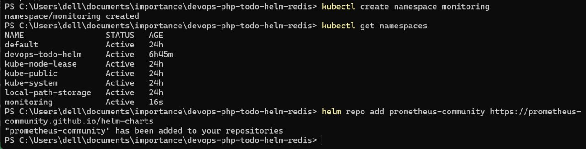
Update Helm repositories:

```bash
helm repo update
```

Create a dedicated monitoring namespace:

```bash
kubectl create namespace monitoring
```

---

# 49. Install kube-prometheus-stack

Install:

```bash
helm install prometheus-stack \
  prometheus-community/kube-prometheus-stack \
  --namespace monitoring
```
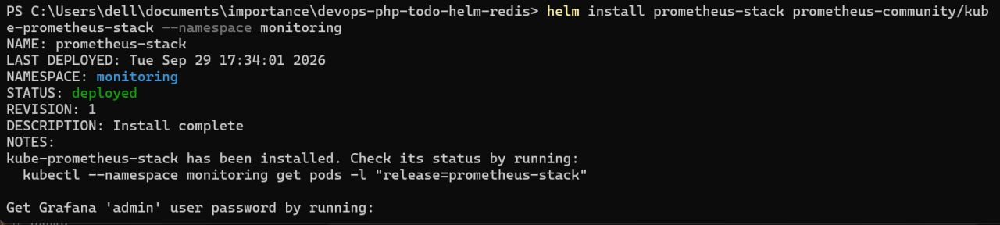
This installs the main monitoring components.

The stack includes:

```text
Prometheus
Grafana
Alertmanager
kube-state-metrics
Node Exporter
```

---

# 50. Check Monitoring Pods

Run:

```bash
kubectl get pods -n monitoring
```

The monitoring namespace should contain Pods for components such as:

```text
Prometheus
Grafana
Alertmanager
kube-state-metrics
Node Exporter
```

Check all resources:

```bash
kubectl get all -n monitoring
```

---

# 51. Verify Prometheus

Check the Prometheus resources:

```bash
kubectl get prometheus -n monitoring
```

Then check the Prometheus Pod:

```bash
kubectl get pods -n monitoring
```

Prometheus collects metrics from Kubernetes and its monitored workloads.

Examples include:

* CPU usage
* Memory usage
* Pod status
* Deployment status
* Node metrics
* Kubernetes object metrics

---

# 52. Verify Node Exporter

Node Exporter runs on the Kubernetes nodes and exposes hardware/OS-level metrics.

Check:

```bash
kubectl get pods -n monitoring
```

There should be Node Exporter Pods running across the Kubernetes nodes.

The architecture is:

```text
Kubernetes Nodes
      │
      ▼
Node Exporter
      │
      ▼
Prometheus
```

---

# 53. Verify kube-state-metrics

kube-state-metrics exposes Kubernetes object state.

It provides information about objects such as:

* Pods
* Deployments
* StatefulSets
* Services
* Nodes
* ReplicaSets

Check:

```bash
kubectl get pods -n monitoring
```

The kube-state-metrics Pod should be running.

---

# 54. Access Grafana

Grafana is used to visualize the metrics collected by Prometheus.

Port-forward Grafana:

```powershell
kubectl port-forward svc/prometheus-stack-grafana `
  -n monitoring 3000:80
```

Open:

```text
http://localhost:3000
```

---

# 55. Get the Grafana Password

The Grafana administrator password is stored in a Kubernetes Secret.

Run:

```powershell
kubectl get secret prometheus-stack-grafana `
  -n monitoring `
  -o jsonpath="{.data.admin-password}" | base64 -d
```

Use:

```text
Username: admin
Password: <decoded password>
```

Do not commit the password to Git.

---

# 56. Verify Grafana and Prometheus Integration

After logging into Grafana, Prometheus should already be configured as the monitoring data source by the Helm chart.

Grafana can now display Kubernetes metrics collected by Prometheus.

Typical dashboards can show:

```text
CPU
Memory
Pods
Nodes
Deployments
Namespaces
Network
Kubernetes health
```

---

# 57. Verify Alertmanager

Alertmanager is responsible for handling alerts generated by Prometheus.

Check:

```bash
kubectl get pods -n monitoring
```

Alertmanager should be running.

Check its Service:

```bash
kubectl get svc -n monitoring
```

The architecture is:

```text
Kubernetes
     ↓
Prometheus
     ↓
Alert Rules
     ↓
Alertmanager
     ↓
Notification System
```

This provides the foundation for production-style monitoring and alerting.

---

# 58. Verify the Complete Kubernetes Environment

Application namespace:

```bash
kubectl get all -n devops-todo-helm
```

Monitoring namespace:

```bash
kubectl get all -n monitoring
```

Nodes:

```bash
kubectl get nodes
```

Helm releases:

```bash
helm list -A
```

The final environment contains:

```text
Kubernetes Cluster
│
├── devops-todo-helm
│   │
│   ├── PHP Todo ×3
│   ├── Redis
│   ├── MySQL
│   ├── MySQL PVC
│   ├── Services
│   ├── Secrets
│   └── ConfigMaps
│
└── monitoring
    │
    ├── Prometheus
    ├── Grafana
    ├── Alertmanager
    ├── kube-state-metrics
    └── Node Exporter
```

---

# 59. Complete CI/CD Architecture

The complete CI/CD workflow is:

```text
                   GitHub
                      │
                      ▼
                  Jenkins
                      │
             ┌────────┴────────┐
             │                 │
             ▼                 ▼
        Docker Build       Docker Test
             │                 │
             └────────┬────────┘
                      ▼
                 Docker Hub
                      │
                      ▼
                   Helm
                      │
                      ▼
                Kubernetes
                      │
          ┌───────────┼────────────┐
          │           │            │
          ▼           ▼            ▼
        PHP         Redis        MySQL
        ×3                         │
                                   ▼
                                  PVC
```

Monitoring operates alongside the application:

```text
Kubernetes
    │
    ▼
Prometheus
    │
    ├── Node Exporter
    ├── kube-state-metrics
    │
    ▼
Grafana
    │
    ▼
Visualization

Prometheus
    │
    ▼
Alertmanager
    │
    ▼
Alerts
```

---

# 60. GitHub Webhook — Final Automation Enhancement

The final optional improvement is to remove the need to manually click:

```text
Build Now
```

A GitHub webhook can trigger Jenkins automatically.

The desired workflow becomes:

```text
Developer
    │
    ▼
git push
    │
    ▼
GitHub
    │
    │ Webhook
    ▼
Jenkins
    │
    ▼
Docker Build
    │
    ▼
Docker Test
    │
    ▼
Docker Push
    │
    ▼
Helm Deploy
    │
    ▼
Kubernetes
```

This turns the project into a more complete automated CI/CD pipeline.

---

# 61. Configure Jenkins for GitHub Webhooks

In the Jenkins Pipeline job, enable:

```text
GitHub hook trigger for GITScm polling
```

Then configure the GitHub repository.

Go to:

```text
GitHub Repository
        ↓
Settings
        ↓
Webhooks
        ↓
Add webhook
```

The webhook URL will point to the Jenkins webhook endpoint:

```text
http://<JENKINS_HOST>/github-webhook/
```

For a locally running Jenkins instance, external GitHub access requires an appropriate public/tunnel endpoint.

Do not expose Jenkins directly to the public Internet without proper security controls.

---

# 62. Test the Webhook

Make a small change:

```bash
git add .
git commit -m "test github webhook"
git push origin main
```

GitHub sends the webhook.

Jenkins receives it and automatically starts the pipeline.

The complete automated process becomes:

```text
git push
   ↓
GitHub
   ↓
Webhook
   ↓
Jenkins
   ↓
Checkout
   ↓
Docker Build
   ↓
Docker Test
   ↓
Docker Push
   ↓
Helm Lint
   ↓
Helm Upgrade
   ↓
Kubernetes
   ↓
Rollout Verification
```

---

# 63. Final Project Structure

The completed project has a structure similar to:

```text
devops-php-todo-helm-redis/
│
├── Apps/
│   ├── index.php
│   ├── add.php
│   ├── edit.php
│   ├── delete.php
│   ├── db.php
│   ├── redis.php
│   └── styles.css
│
├── Jenkins/
│   ├── Dockerfile
│   └── kubeconfig
│
├── helm-chart/
│   ├── Chart.yaml
│   ├── values.yaml
│   │
│   ├── files/
│   │   └── taskdb.sql
│   │
│   └── templates/
│       ├── app-deployment.yaml
│       ├── app-service.yaml
│       ├── mysql-secret.yaml
│       ├── mysql-init-configmap.yaml
│       ├── mysql-statefulset.yaml
│       ├── mysql-service.yaml
│       └── redis.yaml
│
├── Dockerfile
├── Jenkinsfile
└── .gitignore
```

The kubeconfig file should remain excluded from Git.

---

# 64. Final Technology Stack

The completed Project 4 demonstrates:

### Application

```text
PHP
Apache
MySQL
Redis
```

### Containers

```text
Docker
Docker Hub
```

### Kubernetes

```text
Kubernetes
Deployments
StatefulSets
Services
Secrets
ConfigMaps
Persistent Volumes
Readiness Probes
Liveness Probes
Namespaces
```

### Helm

```text
Helm
Helm Charts
Helm Values
Helm Templates
Helm Lint
Helm Upgrade
```

### CI/CD

```text
Jenkins
GitHub
Docker Build
Docker Test
Docker Push
Helm Deploy
Kubernetes Verification
```

### Monitoring

```text
Prometheus
Grafana
Alertmanager
kube-state-metrics
Node Exporter
```

---

# 65. Final Project Workflow

The complete project demonstrates a production-style DevOps workflow:

```text
                         ┌──────────────┐
                         │    GitHub    │
                         └──────┬───────┘
                                │
                             Webhook
                                │
                                ▼
                         ┌──────────────┐
                         │    Jenkins   │
                         └──────┬───────┘
                                │
                    ┌───────────┼───────────┐
                    │           │           │
                    ▼           ▼           ▼
                 Build        Test         Lint
                 Docker       Image        Helm
                    │           │           │
                    └───────────┼───────────┘
                                ▼
                         ┌──────────────┐
                         │  Docker Hub  │
                         └──────┬───────┘
                                │
                                ▼
                         ┌──────────────┐
                         │     Helm     │
                         └──────┬───────┘
                                │
                                ▼
                    ┌──────────────────────┐
                    │      Kubernetes      │
                    │                      │
                    │  PHP ×3             │
                    │  Redis               │
                    │  MySQL               │
                    │  PVC                 │
                    │  Secrets             │
                    │  ConfigMaps          │
                    └──────────┬───────────┘
                               │
                               ▼
                    ┌──────────────────────┐
                    │      Monitoring      │
                    │                      │
                    │ Prometheus           │
                    │ Grafana              │
                    │ Alertmanager         │
                    │ kube-state-metrics   │
                    │ Node Exporter        │
                    └──────────────────────┘
```

---
